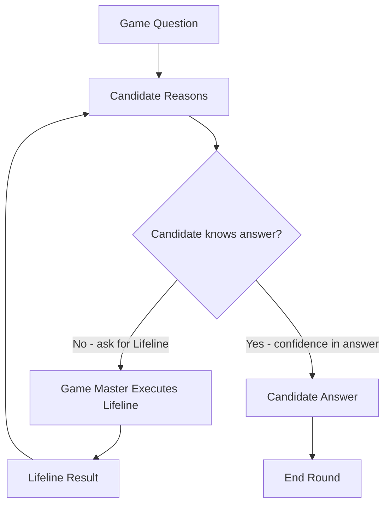

# Vibe Coding Workshop

"How does it work" is the main objective. Therefore we have several targets for this workshop:

* I want to show codex, opencode and a self-made agent
* Install local coding agents: you don't need to buy tokens

* We want to learn how coding agents work
* Understand the agentic coding loop

* What **can** we do with coding agents
* What **should** we do with coding agents

-> Do this now:

clone https://github.com/Orbiter/vibe-coding-workshop

---

## Cloning the Workshop files

It could be that there are not-developers here, so this is how you get the workshop files:

- you must open a terminal
- you must have `git` installed
- in the terminal, you type
```
git clone https://github.com/Orbiter/vibe-coding-workshop.git
```
- you would find out about that by opening https://github.com/Orbiter/vibe-coding-workshop
- then click on the green "code" button
- you copy the https clone address

If you never cloned a repository, its good to make first make a `git` folder where you can clone all cloned projects inside.

---

## The Workshop files

```
vibe-coding-workshop
├── agents
│   ├── opencode
│   │   └── opencode.json
│   └── opx
│       ├── opx.sh
│       └── README.md
├── inference
│   └── ollama
│       ├── docker-ollama-cpu.sh
│       ├── docker-ollama-gpu.sh
│       ├── docker-ollama-update.sh
│       ├── ollama_serve.sh
│       └── ollama_update.sh
└── README.md
```

This gives you the workshop slides (in `README.md`), a opencode.json config, ollama helper scripts and a very simple coding agent `opx.sh`.

---

## This is experimental

* I don't know what happens
* You maybe know it much better, pls share it
* I try to bring some insights that I find helpful
* Things true today are wrong tomorrow
* I wasted too much time to vibe-code this presentation app
* I hate bullet-point presentations, sorry

---

## Workshop Set-Up

* we download Ollama from http://ollama.com
* when ollama is running, we load a model, then do:
  * `ollama pull qwen3.5:4b` if you have at least 8GB RAM
  * `ollama pull qwen3.5:9b` if you have at least 16GB RAM
  * `ollama pull qwen3.5:35b` if you have at least 32GB RAM

That will make it possible to run local models and use opencode locally.
You then can also run a prompt in the command shell like
```
ollama run qwen3.5:4b
```

* Download and install https://opencode.ai/
* we configure it to run with our own model, so you need the workshop repository for it (did you clone the repository https://github.com/Orbiter/vibe-coding-workshop ?)

If you have a 20$ OpenAI subscription:

* Download and install Codex CLI: https://developers.openai.com/codex/cli/

Do all of that right now because it takes time...

---

## What Is Vibe Coding?


**Vibe Coding** is a paradigm shift in software development:
Instead of manually implementing every detail, the developer orchestrates multiple AI-powered
tools inside a coding interface (e.g., TUI/IDE integration).

The developer becomes:

* Architect
* Decision-maker
* Demand generator

The agent becomes:

* Analyst
* Coding assistant
* Quality reviewer

Vibe coding is not “AI writes code.”
It is **collaboration within an agentic loop**.


---

## The Agentic Loop (in real life)

When a LLM calls a tool, it is like calling for a lifeline in the game "Who wants to be a millionaire?":


Game Master asks question -> Candidate ask back "I want a lifeline" -> Game Master performs lifeline 

## The Agentic Loop (in AI)

When a LLM calls a tool, it is like calling for a lifeline in the game "Who wants to be a millionaire?":


User asks question -> LLM ask back "I want a tool" -> User (chat) framework executes tool 

---

## Agentic Loop Comparison

WWTBAM <-> Agentic Loop



.

```
flowchart TD
    Q[User Prompt] --> C[Agent Reasons]
    C --> D{LLM knows answer?}
    D -->|No → Request Tool Call| GM[Agent Performs Function Calling]
    GM --> R[Tool Result]
    R --> C
    D -->|Yes → Commit to Answer| A[Agent Response]
    A --> End[End Round]
```

---

## Set-up Opencode With Ollama Models

When you downloaded and installed opencode, it wants to connect to some
cloud services for inference. We configure it to use our own ollama instance:
```
cp vibe-coding-workshop/agents/opencode/opencode.json ~/.config/opencode
```
Then start opencode. When it is running, type inside opencode:
```
/connect
```
- you must do this for *Plan* and *Build* (toggle with tab)
- for the API key, enter anything
- select the ollama model that you downloaded.

This is configured to use `qwen3.5:4b` by default, if you downloaded this you don't need to use `/connect`

---

## Codex demo

Codex comes in two versions:

- as a command-line version, simply start `codex` in you terminal.
- as a desktop application, you can download this from https://developers.openai.com/codex/cli/

---

## Prompt Examples: Code Understanding and Set-Up

**Goal:** Understand the code
```
Read the code and describe the overall architecture, the data flow,
the communication components, the configuration options and other details.
Then write (or extend) an AGENTS.md with your insights.
```

**Goal:** (Optional) Prepare AGENTS.md for your coding style
```
I want to prepare pull requests for this project. Change your coding style
in such a way that every change is restricted to not more than three files.
Changes which require more files to be modified should be splitted into
several commit steps, do a step-by-step refinement of the prompt
and recommend separated commit steps.
Write/add this to the AGENTS.md file.
```

---

## Prompt Examples: Project Maintentance

**Goal:** Find out how to process
```
Suggest what we should implement next.
```

**Goal:** Clean up
```
Check the code for superfluous functions, unused libraries and
suggest how to reduce the number of lines by refactoring.
Make a full list, order by impact. Do not make changes.
```

**Goal:** Speed up
```
Check the code for unnecessary or imperformant computation.
Also suggest where caches may help. Be creative. 
```

---

## Prompt Examples: Advanced Project Maintentance

**Goal:** Work on tickets
```
Check the issue tracker at https://github.com/yacy/yacy_search_server/issues
and suggest which ticket should be done next, order by most impact on user experience.
```

**Goal:** Solve tickets
```
Solve https://github.com/yacy/yacy_search_server/issues/749
```

**Goal:** Create a ticket
```
Identify possible memory leak problems.
If you find any, write a ticket for a bug report.
```

---

## Prompt Examples: Working as a software architect

**Goal:** Library Assessment
```
Provide best practices and suitable libraries for implementing the database integration.
```

**Goal:** Testing
```
Find methods to test this code and write testing functions or programs.
```

**Goal:** Understand system structure and weaknesses.
```
Analyze the codebase and create a system architecture sketch
with components and their relationships using a mermaid diagram.
```

---

## Prompt Examples: Post-Coding Tools

**Goal:** Use the agent as a quality filter.
```
Make a git diff and determine whether the changes introduce errors.
```

**Goal:** Write a commit message
```
Make a git diff and write a commit message
```

**Goal:** Commit code (requires `gh`)
```
Make a git diff, write a commit message and commit the code.
```
---

## Our Own Coding Agent

In `vibe-coding-workshop/agents/opx/opx.sh` we have a minimal coding agent, written in `bash` entirely.
It provides two tools: `bash` and `write_file`.

```
vibe-coding-workshop/agents/opx/opx.sh "Make a git diff and write a commit message"
```

The agent can run with the ollama models:

```
% vibe-coding-workshop/agents/opx/opx.sh -h
Usage: opx.sh [options] <prompt>
Options:
  -m <model>      model name (default: qwen3.5:4b)
  -h <host>       hostname (default: localhost)
  -p <port>       port number (default: 11434)
  -a              auto-grant configured safe commands
  --help          show help and exit

Auto-granted commands (used only with -a): ls, ls *, pwd, git status, git diff, git diff *
```

---

## The Agentic Loop (in code)

This is the actual code of the agentic loop in `opx.sh`

```
while :; do
  # Start a fresh turn before asking the model what to do next.
  tool_name=""; tool_args_unescaped=""; tool_id=""; tool_input=""
  json="$(jq -cn --arg model "$model" --argjson messages "$messages" --argjson tools "$tools" '{model:$model,messages:$messages,tools:$tools,stream:false}')"

  # Call the LLM and request the next assistant response from the model.
  response=""
  if ! response="$(curl -sS -f -H "Content-Type: application/json" -d "$json" "$url")"; then
    echo "Network error" >&2
    exit 1
  fi

  # Extract assistant text plus any requested tool call from the response.
  extract_response_fields "$response"
  if [ -n "$chunk" ]; then printf '%s' "$chunk"; fi

  # Feed tool results back into the conversation until the model stops asking.
  if handle_tool_call; then
    log "Tool result appended to the conversation; continuing the loop."
    continue
  fi

  # No tool call means the current assistant answer is final.
  break
done
```

---

