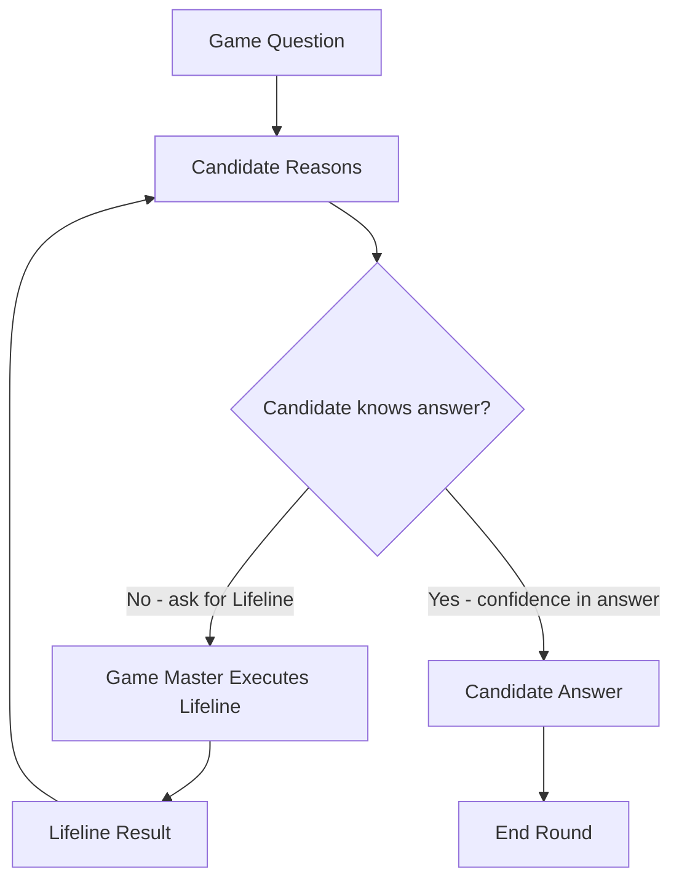

# Vibe Coding Workshop

"How does it work" is the main objective. Therefore we have several targets for this workshop:

* We want to learn how coding agents work
* Understand the agentic coding loop

* Have an overview over the available coding agent software
* Install local coding agents: you don't need to buy tokens

* What **can** we do with coding agents
* What **should** we do with coding agents

-> Do this now:

clone https://github.com/Orbiter/vibe-coding-workshop

---

## The Workshop files

```
vibe-coding-workshop
├── agents
│   └── opencode
│       └── opencode.config
│   └── ollama
│       ├── docker-ollama-cpu.sh
│       ├── docker-ollama-gpu.sh
│       ├── docker-ollama-update.sh
│       ├── ollama_serve.sh
│       └── ollama_update.sh
└── README.md
```

This is mainly about the opencode config and the ollama helper scripts.

And you get the workshop slides in README.md

---

## This is experimental

* I don't know what happens
* You maybe know it much better
* I bring some insights that I find helpful
* Things true today are wrong tomorrow
* I wasted too much time to vibe-code this presentation app
* I hate bullet-point presentations, sorry

---

## Workshop Set-Up

* we download Ollama from http://ollama.com
* when ollama is running, we load a model, then do:
  * `ollama run qwen3.5:4b` if you have at least 8GB RAM
  * `ollama run qwen3.5:9b` if you have at least 16GB RAM
  * `ollama run qwen3.5:35b` if you have at least 32GB RAM

That will make it possible to run local models and use opencode locally.

* Download and install https://opencode.ai/
* we configure it to run with our own model, so you need the workshop repository for it (did you clone the repository https://github.com/Orbiter/vibe-coding-workshop ?)

If you have a 20$ OpenAI subscription:

* Download and install Codex CLI: https://developers.openai.com/codex/cli/

Do all of that right now because it takes time...

---

## What Is Vibe Coding?


**Vibe Coding** is a paradigm shift in software development:
Instead of manually implementing every detail, the developer orchestrates multiple AI-powered
tools inside a coding interface (e.g., TUI/IDE integration).

The developer becomes:

* Architect
* Project manager / Decision-maker
* Demand generator

The agent becomes:

* Analyst
* Draft writer / Coding assistant
* Simulation engine
* Quality reviewer

Vibe coding is not “AI writes code.”
It is **collaboration within an agentic loop**.


---

## The Agentic Loop (in real life)

When a LLM calls a tool, it is like calling for a lifeline in the game "Who wants to be a millionaire?":


Game Master asks question -> Candidate ask back "I want a lifeline" -> Game Master performs lifeline 

## The Agentic Loop (in AI)

When a LLM calls a tool, it is like calling for a lifeline in the game "Who wants to be a millionaire?":


User asks question -> LLM ask back "I want a tool" -> User (chat) framework executes tool 

---

## Agentic Loop Comparison

WWTBAM <-> Agentic Loop



Vs

```
flowchart TD
    Q[User Prompt] --> C[Agent Reasons]
    C --> D{LLM knows answer?}
    D -->|No → Request Tool Call| GM[Agent Performs Function Calling]
    GM --> R[Tool Result]
    R --> C
    D -->|Yes → Commit to Answer| A[Agent Response]
    A --> End[End Round]
```


---

## Assessment of Agentic Coding Tools

| Technical Capabilities | Governance | Engineering Fit |
| --- | --- | --- |
| - Tool calling support<br>- Context window size<br>- Codebase awareness<br>- Multi-file reasoning<br>- Structured output reliability | - On-prem vs cloud<br>- Data retention policies<br>- Auditability<br>- Deterministic replay capability | - Integration with CI/CD<br>- Diff-awareness<br>- Git integration<br>- Test generation quality |

---

## 5. Local Inference vs Cloud Services

### Local Inference Engines

Advantages:

* Full data sovereignty
* Offline operation
* Custom fine-tuning
* Predictable cost

Challenges:

* Hardware requirements
* Setup complexity
* Model management

### Cloud Services

Advantages:

* High-quality frontier models
* Zero infrastructure setup
* Elastic scaling

Challenges:

* Cost unpredictability
* Data compliance
* Latency
* Vendor dependency


---

## 6. Configuring a Local Workflow (Example: OpenCode + Local Inference)

Practical segment:

* Connecting opencode to a local inference engine
* Configuring context limits
* Tool activation and chaining
* Git integration
* Structured output enforcement
* Logging and replay configuration

Participants will:

* Connect to a local model
* Execute analysis prompts
* Trigger tool calls
* Run iterative coding loops

---

# Practical Application Modules

The following sections define structured use cases for vibe coding.

---

# Module 1 — Analytical Tools: Understand Before Changing

The first rule of vibe coding:

> Analyze first. Modify second.

---

### 1. Debugging

**Goal:** Identify root causes and produce structured corrective proposals.

```
Identify the root cause of the performance degradation under high load.
Create a detailed error analysis including corrective suggestions.
```

---

### 2. Intelligent Search

**Goal:** Extract architectural knowledge from the codebase.

```
Find all implementations of user authentication in the project
and show their interaction with other components.
```

---

### 3. Code Analysis & Architecture Sketching

**Goal:** Understand system structure and weaknesses.

```
Analyze the codebase and create a system architecture sketch with components and their relationships
using a mermaid diagram. Identify potential security vulnerabilities and code quality issues.
```

---

### 4. CI/CD & Pre-Commit Integration

**Goal:** Use the agent as a quality pre-filter.

```
Perform a git diff and determine whether the changes introduce errors.
```

---

### 5. Design Pattern Recommendations

**Goal:** Improve structural quality based on context.

```
Provide best practices and suitable libraries for implementing the database integration.
```

---

### 6. Technology Evaluation

**Goal:** Make evidence-based technical decisions.

```
Conduct an assessment of time-series visualization libraries in Python
for the existing test data in the test/ directory.
```

---

# Module 2 — Quality and Governance Support

AI is not only a productivity accelerator — it is a governance amplifier.

---

### 1. Policy Enforcement

```
Review the entire codebase for violations of our coding guidelines and GDPR requirements.
Create a compliance report.
```

---

### 2. Security Threat Modeling

```
Create a threat model for the new payment system and identify potential attack vectors in the design.
```

---

### 3. Technical Debt Analysis

```
Assess the technical debt of the legacy module and prioritize refactoring measures
based on business impact.
```

---

# Module 3 — Code Generation & Structured Implementation

Generation without structure leads to chaos.
Generation inside a loop leads to acceleration.

---

### 1. Bug Fixing via Prompt

```
Fix the null pointer exception in the user loading workflow and document the solution for the ticketing system.
```

---

### 2. Documentation & Knowledge Generation

```
Automatically generate API documentation in Swagger format, code comments,
and an installation guide for the authentication module.
```

---

### 3. Test Case Generation

```
Generate comprehensive unit and integration tests for the existing order processing logic,
including edge cases.
```

---

### 4. Feature & User Story Implementation

```
Read the feature list from the ticketing system and identify three with the highest impact
on processing speed. Then implement these features.
```

---

### 5. Boilerplate Code Generation

```
Generate boilerplate for a new REST API module including database schema and
Docker deployment configuration.
```

---

# Module 4 — Innovation Acceleration

Vibe coding drastically reduces time-to-feedback.

---

### 1. Prototyping & Spike Development

```
Create a proof of concept for integrating AI-driven product recommendations into the shopping cart.
```

---

### 2. Feature Evolution

```
Extend the user profile page with social media integration
based on the attached protocol of potential features.
```

---

### 3. Rapid Performance Optimization

```
Identify suggestions for improving load times on the product page
and implement the most promising ones in a spike.
```

---

### 4. Entry Barrier Reduction

```
Explain how the existing database integration works
and generate an example implementation in Python.
```

---

### 5. Simulation & Scenario Modeling

```
Write a program to generate 10,000 test orders with different load profiles.
These should be executed in a script to evaluate the scalability of the order processing logic.
```

---

# Practical Workshop Flow (Suggested Agenda)

### Part 1 — Foundations (Theory + Discussion)

* What is vibe coding?
* The agentic loop
* Tool assessment framework
* Local vs cloud strategy

### Part 2 — Environment Setup (Hands-On)

* Configure local inference
* Connect opencode
* Run analytical prompts
* Validate structured outputs

### Part 3 — Guided Exercises

* Debugging session
* Architecture sketching
* Threat modeling
* Feature implementation loop

### Part 4 — Advanced Workflows

* Governance integration
* CI/CD automation
* Multi-step tool chaining
* Spike-driven innovation

---

# Final Principles

1. AI is an amplifier — not a replacement.
2. Analysis precedes modification.
3. Every generation step requires validation.
4. Governance is not optional.
5. The developer remains architect and final authority.

---

# Outcome of the Workshop

Participants will:

* Understand the agentic coding loop
* Evaluate AI tooling strategically
* Configure local inference setups
* Execute structured AI workflows
* Accelerate implementation without sacrificing quality

