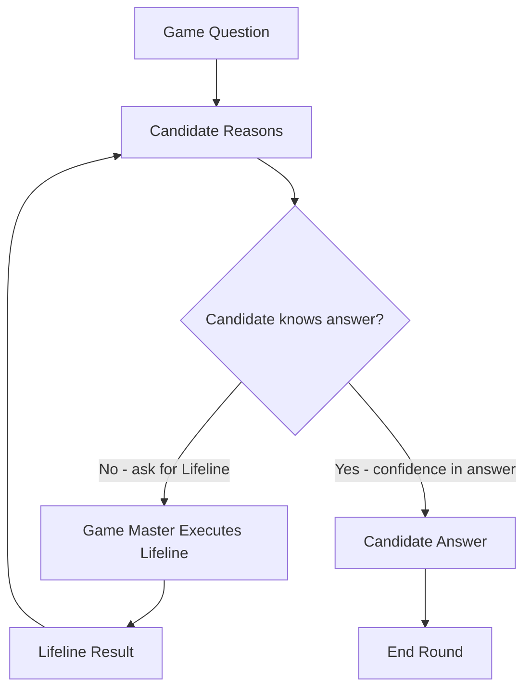

# Working Effectively with AI as a Developer

Practical workflows for collaborating with AI

* How coding agents work and how to use them
* Understand the agentic coding loop
* What **can** or **should** we do with coding agents
* "How do you write a good prompt?"

>
>
> Michael Christen
> http://yacy.net
> mc@yacy.net
> https://github.com/orbiter
> https://x.com/orbiterlab
> https://sigmoid.social/@orbiterlab
>
>


## What Is Vibe Coding?

**Vibe Coding** is a paradigm shift in software development:
Instead of manually implementing every detail, the developer orchestrates multiple AI-powered
tools inside a coding interface (e.g., TUI/IDE integration).

The developer becomes:

* Architect
* Decision-maker
* Demand generator

The agent becomes:

* Analyst
* Coding assistant
* Quality reviewer

Vibe coding is not “AI writes code.”
It is **collaboration within an agentic loop**.


## The Agentic Loop (in real life)

When a LLM calls a tool, it is like calling for a lifeline in the game "Who wants to be a millionaire?":


Game Master asks question -> Candidate ask back "I want a lifeline" -> Game Master performs lifeline 


## The Agentic Loop (in AI)

When a LLM calls a tool, it is like calling for a lifeline in the game "Who wants to be a millionaire?":


User asks question -> LLM ask back "I want a tool" -> User (chat) framework executes tool 


## Agentic Loop Comparison

WWTBAM <-> Agentic Loop



.

```
flowchart TD
    Q[User Prompt] --> C[Agent Reasons]
    C --> D{LLM knows answer?}
    D -->|No → Request Tool Call| GM[Agent Performs Function Calling]
    GM --> R[Tool Result]
    R --> C
    D -->|Yes → Commit to Answer| A[Agent Response]
    A --> End[End Round]
```


## The Agentic Loop (in pseudocode)

```
context = user_prompt

while :; do

  # Call the LLM and request the next assistant response from the model.
  response_message, tool_call = call_llm(context, available_tool_defitinion)

  # Feed tool results back into the conversation until the model stops asking.
  if tool_call; then
    context += tool_response(tool_call)
    continue
  fi

  # No tool call means the current assistant answer is final.
  print(response_message)
  break;

done
```


## Core Question

* "How do you write the best prompt for a given idea?"
* There is no such thing. Good Vibe coding is a series of best practices that also exist outside the use of AI
* You should (as a good programmer)
  * understand the code basis and the used libraries
  * understand the task you want to perform
  * separate your task into smaller controllable steps
  * discuss options, alternatives, risks & advantages
  * explore different approaches
* A good approach for different prompt categories:
  * Understand - simply explore the code
  * Improve - clean up, speed up, test
  * Review - check quality, create documentation
  * Delegate - do coding work (with precision)
  * Operate - CI process & git operation, commit messages
* Be responsible for the result. Don't say "AI did that". You did. AI is just a tool.


## Prompt Examples

**Goal:** Understand the code
```
Read the code and describe the overall architecture, the data flow,
and the configuration options. Then write (or extend) an AGENTS.md.
```

**Goal:** Improve
```
Check the code for unnecessary or imperformant computation.
```

**Goal:** Review
```
Make a git diff and determine whether the changes introduce errors.
```

**Goal:** Delegate
```
Solve https://github.com/yacy/yacy_search_server/issues/749
```

**Goal:** Operate
```
Make a git diff, write a commit message and commit the code.
```

## Key Insights

* Don't expect that AI simply does your work
* To be responsible for the result, **you** must make decisions
* For good decisions, **you** must *know*, *explore*, *test*, *iterate*
* AI helps to shorten those steps and do them easily
* Vibe Code with big steps for fun, act as an expert for production code

But:

Everything true today can be false tomorrow.